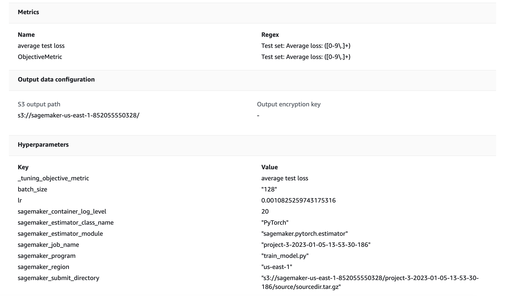

# Image Classification using AWS SageMaker

AWS Sagemaker is used to train a pretrained model (resnet50) that can perform image classification by using the Sagemaker profiling, debugger, hyperparameter tuning and other good ML engineering practices. The provided dog breed classication data set is used for training and testing.

## Project Set Up and Installation
Enter AWS through the gateway in the course and open SageMaker Studio: Done.
Download the starter files: Done
Download the dataset: Done. 

## Dataset
The provided dataset is the dogbreed classification dataset which can be found in the classroom.

### Access
Upload the data to an S3 bucket through the AWS Gateway so that SageMaker has access to the data: Done.

## Project structure

- `train_and_deploy.ipynb` - The main file (jupyter notebook) that calls training, testing etc. scripts and outputs the results of the all the steps of the project.
- `train_model.py` - The Python script which defines the neural network configuration, training and testing functions, data loaders etc. This script is usd by the hyperparameter tuner to find the best set of hyperparameters.
- `hpo.py` - The Python script based on the `train_model.py` with added debugger monitoring. It is used for moel training with the optimal set of hyperparameters.
- `inference.py` - The Pythin script used by the deployed endpoint to make classify images based on the trained model.

## Hyperparameter Tuning
Resnet50 was used the the pretrained model since it provides very accurate image classification (for various classes of images). The pretrained model was augmented by several layers to produce a dogbreed classifier.

I tuned two parameters: leraning rate and batch size.

The hyperparameter ranges used in tuning:
0.001 <= learning rate <= 0.1,
batch size is a value from the list [128, 256, 512]

After four training jobs with different sets of hyperparameters from the specified ranges (find below screenshots of the first two sets tried), the following hyperparameters gave the best results:
learning rate = 0.0010825259743175316
batch siez = 128

## Best hyperparameters training job:

## Debugging and Profiling
Sagemaker seems to make model debugging and profiling pretty easy. The debugging and profiling reports produced give insights regarding the training process, resource utilization etc.

### Results
**TODO**: What are the results/insights did you get by profiling/debugging your model?

**TODO** Remember to provide the profiler html/pdf file in your submission.

## Model Deployment
**TODO**: Give an overview of the deployed model and instructions on how to query the endpoint with a sample input.

**TODO** Remember to provide a screenshot of the deployed active endpoint in Sagemaker.

## Standout Suggestions
**TODO (Optional):** This is where you can provide information about any standout suggestions that you have attempted.
