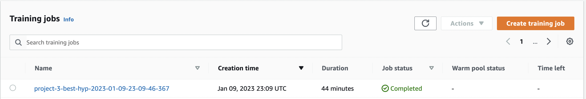
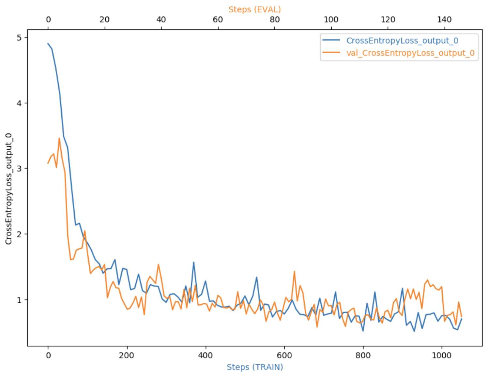
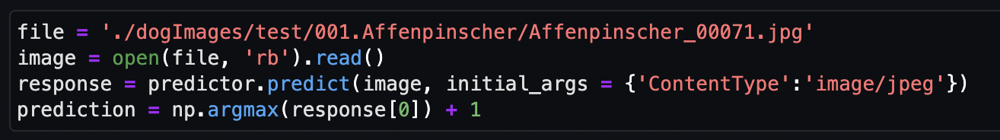

# Image Classification using AWS SageMaker
In this project AWS Sagemaker is used to load a pretrained model (Resnet50) for general purpose image classification, augment it with several extra layers, train the augmented model, and then perform classification of more specific images (images of dogs to recognize their breeds). All that is done using the Sagemaker debugger, profiler, hyperparameter tuning, and other good ML engineering practices. The provided dog breed classication data set is used for training and testing.

## Project Set Up and Installation
SageMaker Studio was run uner my personal AWS account. I downloaded the starter files and the provided dataset.

### Dataset
The provided dataset is the dogbreed classification dataset which can be found in the classroom.

### Access
The data was uploaded to an S3 bucket which was later accessed by SageMaker.

## Project structure
- [train_and_deploy.ipynb](train_and_deploy.ipynb) - The main file (jupyter notebook) that calls training, testing etc. scripts and outputs the results of the all the steps of the project.
- [train_model.py](train_model.py) - The Python script which defines the neural network configuration, training and testing functions, data loaders etc. This script is usd by the hyperparameter tuner to find the best set of hyperparameters.
- [hpo.py](hpo.py) - The Python script based on the `train_model.py` with added debugger monitoring. It is used for moel training with the optimal set of hyperparameters.
- [inference.py](inference.py) - The Python script used by the deployed endpoint to make classify images based on the trained model.

## Hyperparameter Tuning
Resnet50 was used the the pretrained model since it provides very accurate image classification (for various classes of images). The pretrained model was augmented by several layers to produce a dogbreed classifier.

I tuned two parameters: leraning rate and batch size.

The hyperparameter ranges used in tuning:
- 0.001 <= learning rate <= 0.1,
- batch size is a value from the list [128, 256, 512]

A tuner with four training jobs was created. Below are screenshots of two sets of hyperparameters with the resulting acuracies on the test set.

The first set

The second set

## Best hyperparameters training job:
After four runs, the following hyperparameters gave the best results:

Below is the graph showing cross entropy loss on the train and validation sets:

## Debugging and Profiling
Sagemaker seems to make model debugging and profiling pretty easy. The produced profiling report contains a lot of information about the training process, resource utilization etc.

### Results
A zipped file with the profiler report can be found [here](profiler_report.zip)

The report contains
- System usage statistics
- Framework metrics summary
- Rules summary
- Training loop analysis
- And much more

## Model Deployment
The model ws deployed on an ml.p3.2xlarge instance using the [inference.py](inference.py) script. One can use the following code to make an inference:

where "prediction" is the class number of the breed returned by the model.

